# A Set of Contributed Graphs with brief Commentary

## Authors

- David Firth
- Denis Akkavim
- Danius Backis
- Luying Bai
- Maxim Bolshakov
- Mahir Choudhury
- Timothy Coupe
- Zechi Gan
- Lewei He
- Samuel Hine
- David Hooton
- Xingwei Huang
- Chistopher Kakoullis
- Sophie Kempston
- Maciej Kopanski
- Minwoo Kwon (Simon)
- Jia Le Lian
- Richard Mason
- Michael McHale
- Reece Mears
- Alexander Milanovic
- Nathan Mullins
- Nicole Ong
- Dana Penistone
- Neel Sachania
- Niraj Shah
- Benjamin Solly
- Maria Starovoitova
- Jan Terlikowski
- Daniel Timmers
- James Walsh
- Naixuan Wang
- Harrison Wilde
- Yiwen Xu
- Baiyun Yuan
- Ben Atkinson
- (next name to be added here)

(add your name to the above list when you have contributed your file)

## The contributions

### DAVID F

    08 10 14

This plot shows how participation in religious and spiritual activity in the USA is different at different ages.  The graph is based on data from the 2017 American Time Use Survey, in which
respondents recorded how they spent all of their time on the day before they were interviewed.
The above graph shows the percentage of respondents, at different ages, who reported that they had spent any time at all on religious and spiritual activity on the day in question.

The graph shows how such participation increases from less than 10% of 20-year-olds, to 20% or more of the oldest survey respondents.  It should be noted that the data for the very oldest respondents --- those aged 80 and over --- is less reliable than at other ages, partly because of small numbers and partly because of the rounded recording of older ages in the published ATUS data.
    
**The above is just an illustrative example of the sort of graph and text you might include in this file.  I fully expect that some of the graphs you'll produce will be more interesting than this one!**

          	
### ALEXANDER

    01 06 13
    
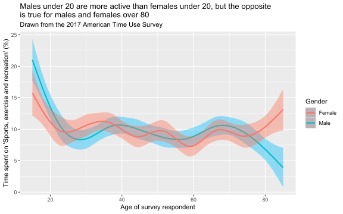

The plot displayed above shows how the amount of time people spend on sports, exercise and recreation varies with age, as well as the influences that gender has on this relationship. The data used to generate the plot is from the American Time Use Survey compiled by the [Bureau of Labour Statistics](https://www.bls.gov/tus/), and can be downloaded [here](https://raw.githubusercontent.com/DavidFirth/lab3/master/atussum_2017.csv). The survey measures the amount of time people spend performing various activities, such as paid work, childcare, volunteering, and socialising.

The plot shows that the time spent on sports, exercise and recreation peaks between the ages of 15 and 25 and decays as people get older. This could likely be due to the fact that people normally have more free time when they are young. When we look at the curves for male and female respondents separately, we see that men are more active than women when they are young, but then women are more active than men between the ages of 75 and 85. In fact, women at the age of 85 spend about 160% more time on sports, exercise and recreation than men of the same age. However, it should be noted that 571 respondents of the total of 10,223 are between the ages of 80 and 85, which represents a proportion of 5.4%, compared to the most abundant age group being the one between 35 and 40 representing a proportion of 9.8% of the total. The difference, although large, should not alone be a reason to discard our previous conclusion, since 5.4% is only slightly below 6.67%, which is the proportion of respondents each category would have if they were assigned randomly (for categories of 5 years).

It is worth noting that the data for ages above 80 is aggregated to be either 80 or 85, most likely due to the fact that less people in that age range participated in the survey. Despite this, we do not expect that this will impact on our results, as we don't require the resolution of the age data to be 1 year.

### BAIYUN

    08 13 18

This plot shows that the percentage of individuals who participated in sports, exercise and recreation at different age and gender,using data from the USA, based on data from the 2017 American Time Use Survey(compile by the Bureau of Labour Statistics), in which respondents recorded how they spent all of their time on the day before they were interviewed.This Survey provides the structure of time alloction for people in different age and gender performing in various activities such as Socialising, Volunteering , Travelling and Childcare.

The above graph shows the percentage of respondents, at different ages and gender, who reported that they had spent any time at all on sports, exercise, and recreation the day in question.

When we ignore the gender influence,for the general trend,the graph is fluctuating after the initial plunge, which started from over 35% of participants aged 15 to less than 20% of participants aged 23 to 30. This may be due to the fact that we have more energy and spare time when we were young. It then fluctuated around 20 percentage with age, with the bottom point occurring around 25, late 50, and the oldest survey participants. The relative peak appeared in participants aged about 35 and nearly 68. In conclusion, younger people engage more in sports, exercise and recreation, especially for those aged 15 to 20 teenagers.

Consider the gender influence,we can observe from two different curves that men are generally more actively engaging in sports, exercise and recreation than women except over 80. It should be noted that 571 respondents aged either 80 or 85 are recorded in the total of 10233 respondents, which occupys nearly 5% in total, therefore it is also a dominant part and should be considered into conclusion. There is enough evidence to show that 85-year-old women spend nearly twice as much time on sports, exercise and recreation as 85-year-old men.

It also should be noted that the data for the very oldest respondents,the data for ages above 80 is only recorded participants aged 85 and this graph is lack of the age data between 81 and 84. Therefore, it is less reliable than at other ages, partly because of small numbers and partly because of the rounded recording of older ages in the published ATUS data. But, this doesn't affect the conclusion made above.

### BENJAMIN A

    01 05 08
     
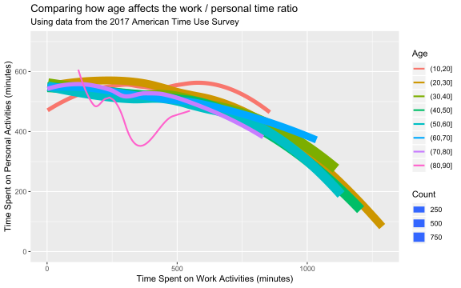

The plot above demonstrates how different age groups manage the amount of time they spend working with respect to the amount of time spent on personal care, using data from the 2017 American Time Use Survey. Participants in the survey were asked how they had spent their previous day, dividing the time spent into 17 set categories, as well as gathering general information about the person (age, sex, etc.). The above plot focusses on 'Personal Care Activities' and 'Work Related Activities' in specific, which encode the amount of time participants spent sleeping and grooming, or working respectively.

The plot shows that, across all age groups, the amount of time spent on personal care decreases more than linearly as the amount of time spent working increases. The majority of age groups follow a similar trend, with the largest deviations comeingfrom the extrememum of the age ranges; the oldest and the youngest.

The oldest category, those aged 80-90, shows that those still working more than 4 hours (240 minutes) typically spent much less time on personal care than their younger counterparts: up to 40%. However, this may not be representative due to the small number of participants in this category. This may be indicative of their lifestyle, as those who continue to work past retirement may be more restless. 

However, those aged 10-20, show a different trend altogether. For those working 8+ hours (480+ minutes) in this group, there was a strong tendency to spend more time on personal activities than their older counterparts. There are numerous potential reasons for this trend, such as a lack of workplace stamina and experience, or an increased propensity for manual labour in this age category. Howeer, more analysis would be required for any concrete conclusions.

### BENJAMIN S

    10 13 18
    

The above plot was created using data gathered in the 2017 American Time Use Survey. Participants were asked to fill out a survey about how much time they had spent during the previous day on 17 different pre-defined categories. In paticular we will be considering the 'travel' category. After splitting the given dataset by sex, we plotted daily time spent travelling against age.

A clear trend is that older people (aged 60+) spend up to 50% less time travelling on average than younger people. This is true for both male and females and could potentially be due to a higher proportion of people in retirement who would not have to commute to work/school/university on a daily basis.   

Interestingly, between the ages of 25 and 70, men spend approximately 5 minutes more travelling per day on average that women. This could be influenced from women taking additional time off work during and shortly after pregnancy and therefore reducing the time they spend commuting on average. The age at which men spent the most time travelling was 41, and for women was 43. 

One thing to consider is the large amount of variation at both the young and old extremes of the data due to a reduced sample size in these areas. Conclusions drawn in these ranges may therefore be less reliable.

    
### CHRISTOPHER

    10 14 16
    
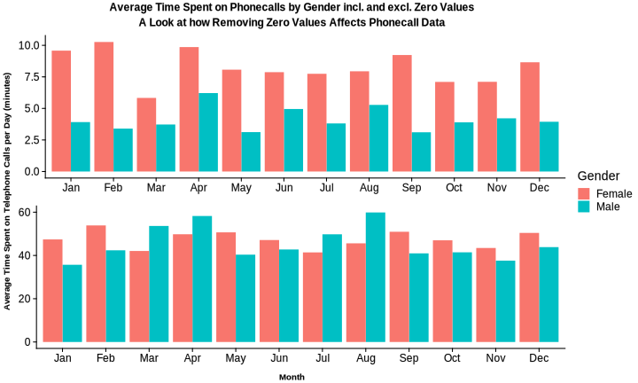
    
The data to pull this graph was taken from the American Time Use Survey (ATUS) 2017. Both of these graphs were generated by finding the mean time per day that people spent on phone calls. The top graph is using all of the available data and the bottom graph is after the values equal to zero have been removed - i.e. only including data where participants said they spent any time at all on phone calls. These graphs were created individually and then plotted on a grid format.

What is interesting about these 2 graphs is that, despite being separated by only one condition, they look like they are based on different variables. The top graph shows that, every month, women spend longer on average on telephone calls than men. This is not reflected in the bottom graph, with some months having this relationship reversed. Two months where differences are extremely notable are April and August. In the top graph, the data shows that for these months, respectively, women spend around 35% and 33% more time on telephone calls, whereas the bottom graph data shows that men spend 14% and 23% more. Clearly, this just shows that more male participants responded with 0 for this activity, leading to a lower average result than females, when 0's are included.

Another difference between the two is the shape of the graphs. Some months in the first graph look to have a substantially lower value (for both genders) compared to the months around them. The most obvious month that reflects this is March. It appears that average time spent on telephone calls is roughly half of that in April, whereas in the second graph there looks to be only a small difference between the two. Part of this is attributable to the different scales - small numerical differences give larger graphical differences in the first graph, but the differences should remain proportional and this is not the case here.

This is only a brief analysis into this data, however, it highlights the ease of misrepresenting this data and drawing false conclusions. 
    
### DANA

    05 12 18
    

  
The above graphic shows us the percentage of individuals who participated in any 'Work Related Activity', using data from the USA, based on 2017 American Time Use Survey, in which respondents recorded how they spent all of the time on the day before they were interviewed. The percentage refers to the percentage of participants who spent **any time at all** on work related activities on the dayin question.  Further, the graphic demonstrates how this varies with the sex of the individuals.  

From the graph, we can see that men are more likely to participate in 'work related activities' than woman at all ages - as the green (male) curve, exceeds that of the red (female) curve for all ages. For the entire collection of participants, work based activities are seen to increase from 20% to 40% from the ages of 20 to 25. It can also be seen that participating in 'work based activities' reaches a peak between 40 and 50 years of age; though the peak is slightly later for female individuals, and slightly earlier for male individuals. 

### DANIEL

    03 05 11
    

    
The plot shows how participation % in **work-related activities** varies with age in the USA. The graph is build using [data](https://raw.githubusercontent.com/DavidFirth/lab3/master/atussum_2017.csv) from the 2017 American Time Use Survey (ATUS). The ATUS dataset for 2017 records the amount of time spent by people, in one specific day, in each of 17 categories of activity. This [link](http://htmlpreview.github.io/?https://github.com/DavidFirth/lab3/blob/master/ATUS%20top-level%20time%20use%20categories.html) provides a short description of the 17 categories. 

The graph splits the data dependent on sex and whether the participant had spent *any time at all* on looking after family members. We can see that for the majority of ages, a higher proportion of men spend *any time at all* on work-related activities than women. This is arguably not a big surprise as the US, like most of the world, has a history of men being the household earners. Therefore the more interesting information from this graph is for women, in the 20-48 age range, it appears that part of the reasoning for low participation is because they are spending time looking after family members. For men we cannot make this conclusion as it very much depends on age. 

It should be noted that participants aged 81-84 and 85+ had their ages rounded to 80 and 85 respectively. However, this does not affect any conlusions made above.

### DANIUS  

   06 11 14
   
   

The graph above depicts the relationship between the average time spent on educational activities and the age of the respondents. As one would expect, the younger the respondent, the more they spend time educating themselves. The maximum is attained at 17 years old, when people spend on average 200 minutes per day on education, and then it drops quickly. 7 years later, less than 24 minutes per day are spent on education. It can also be noted that from 50 years old participants practically never spend time on education, which I found quite surprising. 

    
### DAVID

    01 02 05
    

The above graph shows how age and sex differences impact the participants' sleep, with data taken from the [American Time Use Survey.](https://www.bls.gov/tus/). Firstly, we can see that young people, teenagers in particular, slept for longer than any other age group. This is perhaps explained by not spending as much time working, as this age group also spends less time working than any other. The elderly also spend less time working, and more time sleeping, than most other age groups. However, they sleep less than young people, which can be explained by physical differences causing a need for less sleep. In fact, there is significant evidence of a negative correlation between work and sleep, with Pearson correlation coefficient r = -0.32.

Among those with ages 20-60, we see fluctuations in the data. Women in their 40s and 50s sleep less than women at any other point in their lives. A possible explanation for this is motherhood, although we would expect to see a dip earlier in their lives. Men also see a slight increase in sleep during this time. Overall, women sleep more than men, except for those that are very young and old.

It should be noted that the values in this chart seem very large, as the average time spent sleeping for all participants in 8 hours and 36 minutes, and the average for those under 20 is almost 10 hours. A Gallup [poll](https://news.gallup.com/poll/166553/less-recommended-amount-sleep.aspx) found that the average time a US person spends sleeping is 6.8 hours. I only used the category t010101: Sleeping for my graph, so any variation between these is due to the methodology of the studies.
    
### DENIS

    02 03 12
    

The plot shows the how the amount of time spent on housework changes as people age, divided by the gender of the survey respondents. The graph shows that, generally speaking, as one gets older, one tends to spend more time on housework - until one reaches their 70s, when the amount of time spent on housework reduces. Arguably, this should not come as much of a surprise - the older you are, the larger your house is likely to be, and the more time you will need to spend on housework. Furthermore, the elderly tend to be quite frail, and they simply may not be physically capable of spending the same amount of time as they used to spend on housework.

Most notably, we observe that at all ages, women spend more time on housework than men - which, depending on your point of view, may or may not come as a surprise. 

It is also worth noting that there is limited data on participants under the age of 18, and on participants over the age of 80.
    
### FAN

    06 11 16
    
### HARRISON

    05 15 16

Interestingly, when the variables are plotted using a similar methodology to the one followed by David, the two variables begin to insinuate a potentially more complex relationship. The graph depicts smoothed curves of the percentage of people at each age value who participate in each activity for at least some amount of time.

The curve for volunteering related activities has notable increases around the ages of 20 and below, as well as beyond 60-65 which is a fairly standard retirement age. This could be attributed to young people, namely students and people yet to start working full time, having more time to volunteer. Similarly, older people who have retired will also have more time to volunteer.

The percentage of people volunteering falls from around 7% to a low point of almost 3% in mid to late 20 year olds which could signify a significant loss of free time as people start families and careers at this age. It is also interesting to observe a bump in the mid-40's (also observable in time spent working, perhaps as people reach the middle of their life and feel pressured to contribute to something external, be it work or volunteering) followed by an even larger bump at ages beyond 65 where a height of around 10% of people volunteering is reached among assumed retirees.

The general pattern of the data is clear in that the majority of time spent is on working between the ages of 20's to 60's, as would be expected intuitively. It is unfortunate that the numbers of people volunteering and time spent volunteering is significantly lower than that of people working. Though the way in which people split their time does indeed suggest a conclusion of a weak relationship between people who work less having a higher probability of spending at least *some* time volunteering.
 
### JAMES

    03 08 14
    
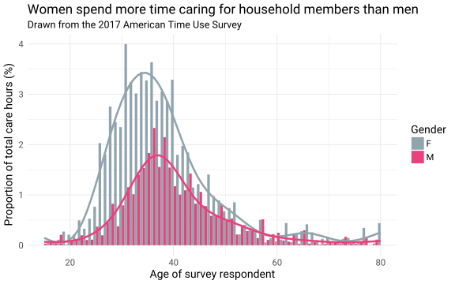

The above figure conveys an inequality in both gender and age of individuals caring for members within the American home. Participants of the 2017 American Time Use Survey (ATUS) were expected to note how many hours of the day before their interview they had spent on various tasks. In the graph, we may see the proportion of the total reported hours directed to this care, split by age and sex.

Of all reported hours caring for others within their home, across almost all ages, females (grey) report a higher number of hours than males (pink). Secondly, younger woman (25-35) spend considerably more time on this task than men of the same age range. Interestingly, men do show a clear peak in their late thirties, perhaps correlated to their aging parents seeking their help. The trend lines are provided solely for illustrative purposes of indicating the distinct differences in proportions, as they have not been statistically scrutinized. Similarly, the tails of these rough distributions, and hence these data, should be considered somewhat unreliable due to small sample size within these age ranges.

    
### JAN

    04 13 15
   
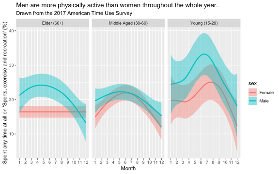 
    
The plot shows how the physical activity of men and women in USA differs throughout the year for different age categories. The whole population has been divided into 3 age categories, i.e. Elder (above 60 years), Middle Aged (between 30 and 60) and Young (from 15 to 29). The graph is based on data from the 2017 American Time Use Survey, in which respondents recorded how they spent all of their time on the day before they were interviewed. The graph depicts the percentage of people belonging to given category who reported that they spent at least a while on sports, recreation or exercise.

The graph shows a seasonal pattern. Both men and women exercise most often during the warm months - between May and September. This is probably because of the fact that most people prefer to do sports outside and summer is the right time for it. It can be also seen that activity is smaller in December than in January. The reason for it could be New Year's resolutions made by many people these days. The graphs also show that the activity is the biggest for youngest people, but for Middle Aged and Elderly it is similar - surprisingly even a bit higher for elderly people. It should be also mentioned that men are more active than women throughout the whole year and for all age categories. Only for Elder group, it can be seen that man are less active than women in the last 2 months of the year. However, this is probably caused by the small number of female respondents as the graph for this category is completely flat.

### JIA

    07 08 18
    

This plot illustrates the proportion of males and females who spent time on making consumer purchases by age, on a monthly basis. The data is taken from the 2017 American Time Use Survey, which recorded the time spent by individuals on the day before their interview. 

In general, the proportion of individual who spent time purchasing consumer goods increases with age, peaking at around 40 years old. This is followed by a downward slope as we move towards the 60-80 age range. This could be explained by elder people having restricted mobility compared to younger people, thus many of them no longer spent time on consumer purchases. 

It is also evident that, there is a larger proportion of female who spent time on making consumer purchases than male as the red lines are mostly above the blue lines. Besides, it is interesting to observe that there is a largest difference in proportion of men and women, aged between 20 and 40, who spent time on consumer purchases in February and April whereas, there is least difference in the proportion in May and December. 

It should be noted that there are more females who spent time on consumer purchases and data from those aged over 80 is less reliable because of rounding and there are only a small number of them. 

### LANGLANG

    02 11 18
   

The plot shows how participation in household activities in the USA is different at different ages and different gender. The graph is based on data from the 2017 American Time Use Survey, in which respondents recorded how they spent all of their time on the day they were interviewed. The above graph shows the average time they spent on households activities per month at different age. 

The graph shows that the average time per month participants spent on housework increased as they getting older and started decreasing since around 70 years old. We can also see that female spent more time on housework than male at every age. The difference between female and male increased around 20s and decreased slightly around their 50s.

### LEWEI

    01 06 08

![Lewei's graph of education vs month and sex]LeweiH-plot.svg)

This plot shows how participation in education in the USA is different at different months between male and female. The graph is based on data from the 2017 American Time Use Survey, in which respondents recorded how they spent all of their time on the day before they were interviewed. The above graph shows the percentage of respondents, between the two sex, who reported that they had spent any time at all in education on the day in question for each month.

The graph shows how such participation varies on a monthly basis, that fewer people engage in education over summer and winter vacations (in June, July, August, and December). Also, in distinguishment of male and female, female engage more than male during "Autumn term" and male engage more for the rest of the year. It should be noted that the respondents displayed this plot is only a small proportion of the whole set of respondents as the first quantile is at age 35 while this plot only uses data for age under 30 as generally, they engage more in education.

    
### LUYING

    06 08 15
    
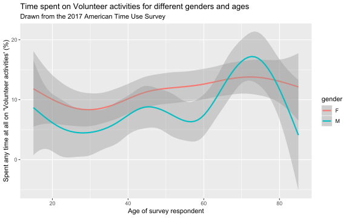
    
This plot shows how participation in volunteer activities in the USA is different at different ages.  The graph is based on data from the 2017 American Time Use Survey, in which respondents recorded how they spent all of their time on the day before they were interviewed.
    
The above graph shows the percentage of respondents, at different ages and genders, who reported that they had spent any time at all on religious and spiritual activity on the day in question.

The graph shows that for female respondents, the proportion of time spent on volunteer activities remains in the same level at around 13% except for the age 30s, where illustrates a small, drop, decreasing to 8%. Similarly, the data of male participants also witness a drop in their 30s, from 9% to 5%. However, different from the data of female participants, there is a significant peak of the percentage of time spent by male respondents on volunteer activities, rising sharply to 17% and then drop to 4%.
    
In conclusion, for most of the ages, female participants spend more time on volunteer activities than male participant except for the men st the age of 72.
    
### MACIEJ

    12 16 18
    

This plot shows how the usage of telephone calls in the USA is different at different ages for each sex. The above graph shows the percentage of respondents, at different ages, for each sex, who reported that they had spent any time at all on phone calls on the day in question.

For men the usage of phone calls drops from the initial level (15 year old) of 13% to 8% for people aged 45. Then this number increases up to almost the initial level for men above 80 years old. 

For women the usage also drops initially. Around 18% of females aged 15 spent any amount of time talking on the phone on that day. This number drops to 12% for women who are 35 years old. Then, as it was for men, the usage increases, but for women it even exceeds the initial level. For women aged 75 and above the phone calls usage is at 25%.

The shapes of the graphs for men and women are similar. However, the one for women shows bigger changes in phone usage at different ages. Moreover, the usage of phone calls is higher for women than it is for men in all age groups. This is an interesting finding, as it shows the difference in communication habits between sexes.

It should be noted that the data for seniors (over 80) is less reliable, due to the small number of respondents and because of rounding of the recordings of ages in the ATUS data. Moreover, the sample for people aged 18 to 25 is also quite small (less than 100 people of each age) compared to people aged 35 to 40 (around 200 people of each age).

    
### MAHIR

    04 06 16

This graph shows how the time spent on telephone calls varies with age in the USA, using data from the '2017 American Time-Use survey', in which Survey Respondents were asked how much time had they spent across 17 particular activities during the particular day in which they were interviewed.  The line graphs display the expected value of time spent on telephone calls given the age in question. The shaded areas represent the 95% confidence interval for time spent on telephone calls given the age. The data has been split into gender categories and plotted accordingly.

From the graph, it is clear that regardless of age that females on average spend a larger amount of time on telephone calls than males. Between the ages 15-40, we can see that the curves follow a relatively similar trend with the Female curve hovering above the male curve. Their confidence intervals largely overlapping whilst both steadily declining as the age gets closer to 40. Particularly, we can see around the age of 32 that the time is within a minute of each other- leading one to question whether this slight difference is simply variance in the data.  

However, as we go beyond 40 we can observe a much steeper increase in these times for Females than the males. The times for Males pratically remains unchanged between 40-60 staying around the 4 minute mark, whilst by this stage for females, it has shot up to 10 minutes with the confidence intervals far apart. One might question why this may be the case - perhaps there are certain lifestyle changes to females ,which do not apply to males, which occur around the age of 40. An alternative could be changing times in the younger generation which could follow a pattern similar to the men as time progresses - who knows.

From here there's a continued increase for both genders up to 85, where the data stops. It is important to note that there's larger confidence intervals for both genders most likely due to the fact that there's no data between ages 80-85. No confidence interval overlapping suggests this isn't a problem .
    
### MARIIA

    02 06 11

    
The plot above shows how the time spent on household activities (e.g. laundry, cleaning, food preparation, etc) changes as the number of children in the household increases. The data used for constructing the plot is from the 2017 American Time Use Survey (ATUS), conducted by the Bureau of Labour Statistics. During the survey 10,223 people were interviewed on how much time they spent on certain activities (such as work and work-related activities, personal care, household activities, consumer purchases, volunteering, etc.) on the day before the interview.

The graph above has the reported number of children under 18 in the household on the x-axis and the mean time spent on household activities per day (in minutes) on the y-axis. The respondents were split into two categories by sex (in colour).

We observe that the mean time spent on household related activities (combined for both women and men) goes up as the number of children in the household increases. However, it is curious that for women this increase seems to be much more pronounced (going linearly from 140 minutes in the household with no kids to 212 in the households with 7 kids) than for men. 

It should be noted that 2 datapoints were excluded from the plot (two respondents with 8 and 11 children respectively) as 1 datapoint is not enough to derive any conclusion about the whole group. Also note that the presented data for the households with the most children (more than 5) is less reliable due to the small number of observations (11 respondents with 6 children and 6 with 7 children). 

    
### MAXIM
   
    12 13 16

This plot shows how the attendance rates of 3 types of events differ at different ages in the US population.  The graph is based on data from the 2017 American Time Use Survey, in which respondents recorded how they spent all of their time on the day before they were interviewed. 

The above graph shows the percentage of respondents, at different ages, who reported that they had spent any time at all on attending sports events, social events and arts & entertainment events on the day in question.

The graph shows a general downward trend for the social and sports events attendance rates. The arts and entertainment events attendance rate is constant around 3%. For arts & entertainment events, the decrease is from approximately 4.5% for the youngest to 3%  for the oldest, and the rate for the sports events falls from 5.5% to below 1 %.

On average, arts and entertainment events have the highest rate of attendance, sports events have the lowest and social events are in between. However, the rate of sports events attendance is the highest for the youngest, but it quickly drops.
    
### MICHAEL

    04 10 12
  
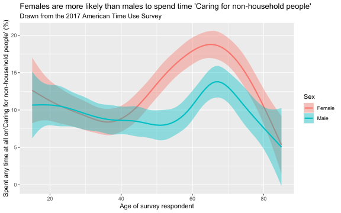

This graph shows how the change of age effects whether a person partkaes in 'Caring or helping a non-household person' in the USA, and how this differs between males and females.The data used to produce this graphic is from the 2017 _American Time Use Survey_, in which respondents were asked to record which activities they had undertaken the previous day, and for how long.

We can observe that up until they are 38 years old men and women, are equally likley to spend anytime at all caring or helping a non household person. Further to this in this time period, the proportion of people who spend anytime at all caring or helping a non household person has a slow anual decline. This may be because at this time in their lives they are concentrating on careers and their parents (whom one can asume are the most likely non household person they would be caring for) are still relatively young and not dependent on their children, and also that they are looking after their own children who are part of their household.

After this point both males and females have an increase in the likelihood of spending anytime at all caring or helping a non household person, but females increase by a much greater rate. This may be down to the fact that less females are working at this age (possibly due to childbirths), so are able to devote time to caring for a non household person.

The likelihood of either males and females spending anytime at all caring or helping a non household person, decreases at about 67 (close to the retirement age). This could be due to the fact that they are physcially unable to as they themselves reach old age, or also the fact that those whose job it was to care for non household people are also retiring at this age.

### MINWOO

    04 08 12
    
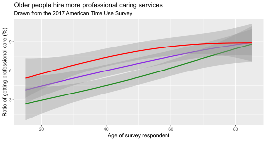
    
   The graph above represents how the change of age and the frequency of usage of professional caring are correlated. The data used in this graph was extracted from the 2017 American Time Use Survey. The participants of this study were asked to take a record of the length of hours that they have been taken care by professional care services. Not only that, but also the age of participants varies from teenagers to 80s.

  To explain the plot more explicitly, the green line represents men hiring professional caring, the red line represents women hiring care, and the violet line in the middle shows the average frequency of using caring service. One thing in common between men and women is that the older they are, the more likely for them to hire professional caring service for themselves. However, it is easy to notice that the rate of change of the graph between men and women differ. To be concise, according to the graph, as women get older, it is less likely for them to have professional health care. On the other hand, the age of men and the need of health care is proportional. As a result, the average percentage of professional health care is nearly proportional to age.

    
### NAIXUAN

    08 14 16
    

The data is drawn from the “2017 American Time Use Survey” data set. Through the exploration of the data set, an interesting correlation between column “age”, “sex” and “telephone calls” has been found. The chart is plotted as the percentage of time spent on “Telephone calls” against age of the respondents. The lines are defined by “sex” with males’ represented in blue and females’ in red. The percentage of females spending time on making phone calls is higher than the percentage of males through all ages. With an increase in age, females tend to spend more time on making phone calls as the red line rises dramatically from 13% to 25% after the age of 40 representing higher proportion of female population. The percentage of males does not fluctuate much through age.
    
### NATHAN

    11 12 15

This graph shows how the amount of time spent on socialising, relaxing and leisure (SR&L) in the USA differs depending on whether a person undertakes volunteer activities. The data used to produce this graphic is from the 2017 _American Time Use Survey_, in which respondents were asked to record which activities they had undertaken the previous day, and for how long. 

\
From the graph, regardless of gender, respondents who spent any amount of time volunteering on a given day spent noticeably less time on SR&L than those not volunteering.

\
Looking at males, the amount of time spent by volunteers on SR&L, on a given day, follows a very similar trend to that of non-volunteers. In fact, it appears the trend for time spent on SR&L by volunteers is, for the most part, a scaled down version of the trend for non-volunteers. The only noticeable difference is for males over 70. 
\
For males over 70 the amount of time spent by volunteers on SR&L deviates from the trend observed in non-volunteers; as age increases there is a decrease in the amount of time spent by volunteering males on SR&L. A possible explanation is the wide 95% confidence interval for volunteers over 70, which suggests that only a small proportion of respondents were males over the age of 70 who engaged in volunteering on a given day.

\
Looking at females, there is no overlap of the 95% confidence intervals for time spent on SR&L by volunteers and non-volunteers. This means we can confidently conclude that, across all ages, there is a statistically significant difference between the time spent on SR&L, on a given day, by volunteers and non-volunteers (Note that this does not infer that since male volunteers and non-volunteers overlap there isn't a statistically significant difference).
\
The trend for female volunteers does not match that of the female non-volunteers as closely as the trends for males does. This is particularly true for females under the age of 30. The 95% confidence interval for volunteering females under 30 is much wider than that of non-volunteers. This suggests that, out of all female respondents, relatively few of them under the age of 30 were engaged in volunteering on a given day.

    
### NEEL

    04 07 15
    
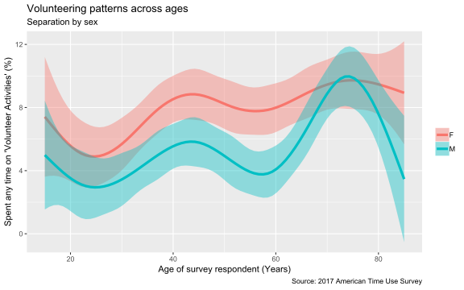

This plot shows how participation in volunteering activities in the USA varies for different ages. The graph is produced using data from the 2017 American Time Use Survey (ATUS), in which data has been collected to better understand how time is divided across different activities. The above graph shows the percentage of respondents, of different ages, separated by sex who had spent any time at all on volunteering activites. These include a range of activities such as performance, cultural, administrative, care and maintenance activities.   

The graph shows, that the participation percentage for each sex spending any time on volunteering activities follows a similar trend up until the age of 60. From this age, the percentage of male participation in volunteering activities increases significantly, which may correspond to the age of retirement. The peak participation occurs at approximately 73 years of age for both males and females, where roughly 10% of both sexes participate in volunteering activities. It must be noted that the ages of respondents greater than or equal to 80 have been rounded to the ages of 80 or 85, making it less reliable for drawing conclusions. 
    
### NICOLE

    02 06 11
   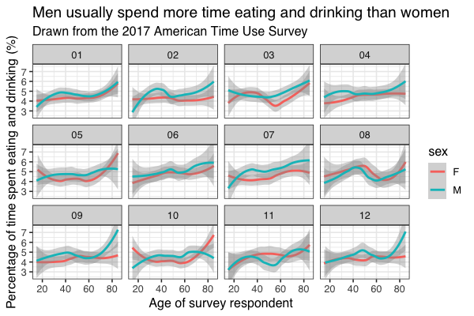 
   
The above plot illustrates the percentage of time a person in the US spends eating and drinking during any given day in a certain month. There are two curves plotted, one for each gender, to highlight any potential gender differences. Data used here is taken from the 2017 American Time Use Survey. 

In general, we can see that across most months and the majority of ages, men spend more time eating and drinking than women. Additionally, the curves seem to illustrate an upward trend, indicating that older people typically spend more time eating and drinking. However, there are a few outliers to the preceding observation, with curves in March (03 on graph) and August (08) exhibiting odd behaviour amongst the 40 to 80 age group. 

It should be noted that at the tail end of the curves, that is especially for ages 80 and above, the curve occasionally moves upwards in a volatile manner. This is likely partially due to rounding effects, whereby higher ages have been rounded to either 80 or 85 in the original dataset. 

Interestingly, the probable correlation between time spent eating and drinking with the age of the respondent is not consistent across the different months, suggesting an element of randomness and potential seasonal effects such as holidays and cultural traditions that influence eating patterns. Thus, it is not possible to conclude with confidence whether or not there is a clear relationship between time spent eating and drinking with the age of the survey respondent. However, the observation that men spend more time eating and drinking than women appears fairly consistent across the different months.
    
### NIRAJ

    03 06 13
    
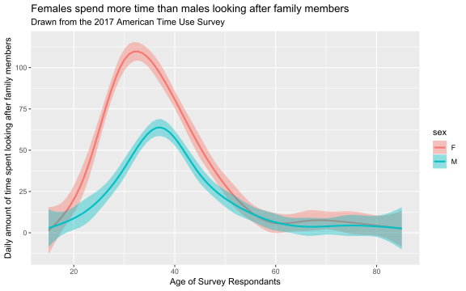

This plot investigates how time spent looking after their household members in the USA varies by age. The red plot shows this relationship for females, and the blue plot shows this relationship for males.

The plot shows that the relationship between time spent looking after household members and age is similar for both males and females. This is, that the amount of time looking after household members increases as age increases to a certain point, and then the time spent looking after household members decreases. We can also clearly interpret from the plot that from ages 15 to 50, females generally spend more time looking after household members than males. However, once ages get to 50 or order, the time spent looking after household members is effectively the same for both females and males. It should not come as a surprise that females spend more time daily in looking after household members than males. The plot also confirms what we should expect when people get older and closer to retirement, as their body is more frail and hence they are unlikely to spend as much time looking after their household members.
    
### REECE

    09 10 12
    

The plot shows how likely different ages of both males and females are to spend more than eight hours per day on socialising, relaxing and leisure per day. The bands around each line show a 95% confidence interval for each of the fits. Time spent on each activity was recorded as part of the 2017 American Time Use Survey.

From the graph, we can see a global trend of people being less likely to spend a quarter of their day socialising around the ages of 30-60; this is perhaps due to most people in this age bracket being employed. The most surprising conclusion to draw is that people over the age of 70 are more likely than not to spend at least 6 hours socialising (as the percentage for males and females exceeds 50%), and in fact by the age of 85, the graph suggests there is a 70% chance. This may be due to a smaller sample size, or rounding in the data, but the result does not seem to be anomalous. It is also interesting how sex does not appear to offer any new trends in the data: the overall trend for both curves is very similar, however that for men is consistently higher, especially for younger ages.
    
### RICHARD

    04 11 12

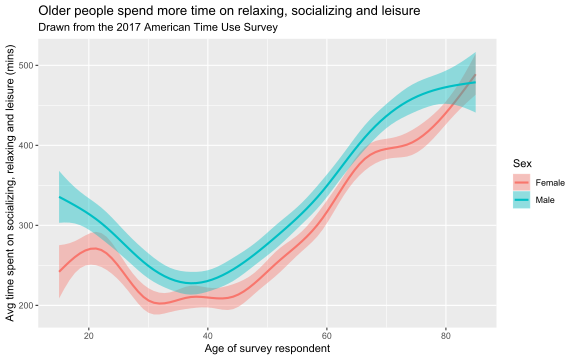

The graph depicts the relationship between the age of the survey participant and the average time spent on relaxing, socializing and leisure, which is divided into male and female.
The graph shows a contrasting relationship between men and women before the age of 20. However, the standard errors are larger for ages below 20, so these average values may not be correct. Furthermore, the sample for these ages may have been taken from people who are in work, and not students, who would have a higher average time for socializing especially. The graph's minimum points are at age 32 for women and 37 for men. One can deduce that these ages for men and women spent the least amount of time on socializing, relaxing and leisure because this could be the age when people decide to start a family, as well as be the busiest with work, with both of these reducing the amount of time a person can spend socializing, relaxing and time on leisure. There is an upward global trend after this, perhaps suggesting that the children of some participants are older and require less time to tend to.

We can observe that men seem to spend more time on these activities than women on average, for the majority of the ages, which has many interpretations, although we cannot draw conclusions.
    
### SAMUEL

    06 09 13
    

    
The plot shows the proportion of time people spend on sports and recreation as opposed to education. Note that only people included in this plot are those who _are_ in education. All respondents were specified to have an age under 25, so the graph isn't clouded by the many ages that are not in education. 
The graph shows that males between the 15-17 age bracket spend far more on recreational activites, since the values for these ages fall above the 0.5 line. As the age increases, the proportions through the ages fall together; reason for this could include and increase in difficulty relating to higher eduation.
For females however, the proportion does not change much over time, perhaps due to female students being more motivated in school.
    
### SANDEEP

    02 04 15
    
### SOPHIE

    04 12 18
    
 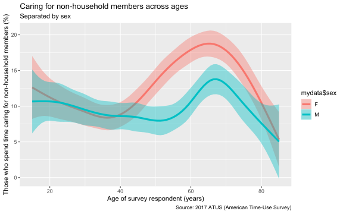
 
The plot shows the percentage of people who care for non-household members at each age. This includes those caring for non-household children and adults, those who spend time on activities related to children's health and education, and those who help household adults. This is then further split by sex.

There is a clear increase in the percentage of respondents with these caring responsibilities in the "mid-life" stages, around 50-75 for both sexes. In most cases, females seem to care more than males; this difference is particularly substantial among those aged between 50 and 75 years old, although both sexes peak at arond 65 years. This could be due to the fact that men are typically expected to stay at work, with women typically expected to take on a more caring role. The peak at 65 years could reflect an aging population, with those who may have typically needed care in previous years now taking over the caring role.

It is important to note that the standard deviations of both under-20s and over-80s are large, which means any conclusions made from these may be spurious and not entirely accurate.
 
    
    
### TIMOTHY

    06 09 11
 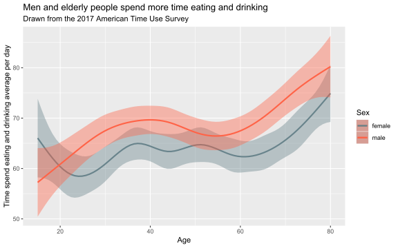   
The data used to generate the plot has come  from the American Time Use Survey. It was created  by the Bureau  of Statistics. The survey measures the amount of time people spend performing 17 different common activities. These include things such education, religious activities, eating and drinking and many others.

The plot below shows on average how many minutes per day Males and Females spent eating and drinking. Females take more time to start with but take a sharp decline until the age of around 25. Meanwhile the males times rises sharply and becomes bigger than the females at around age 20. After the age of 25 the males and females times change is similar patterns with the males constantly spending more time then females. These similar patterns are such because both groups seem to plateau for a long period with slights ups and downs. For the women the eating and drinking times are with 62.5-65 minutes for approximately ages 35-60. For the males from the ages 40-60 there is no significant change with the average time being within 67.5-70 minutes for this whole period. 

After the age of 60 both the times for males and females increase steadily until the 80. Males are take approximately 5 minutes longer then females to eat and drink for the whole period from 60-80.
    
### XI

    03 05 06
    
### XINGWEI

    01 03 07
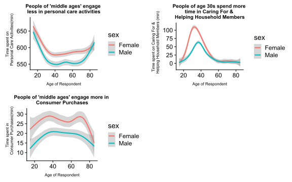

The graphs show the relationships betwwen age of repondents with time spent in "Personal Care", "Caring for & helping household members" and "Consumer Purchases" respectively. The data is from the 2017 American Time Use Survey. It shows that generally, female spend more time in these three categories of activities than male do. Respondents of age 40-60 spend less time in personal care activities and spend more time in consumer purchases relative to respondents of other ages. In case of the time spent in "Caring for & Helping Household Members", it seems that only respondents of ages 20-60 engage in this catergory of activitiies. In addition, respondents of ages 30s seem to engage more than respondents of other ages.
    
### YIWEN

    02 10 14

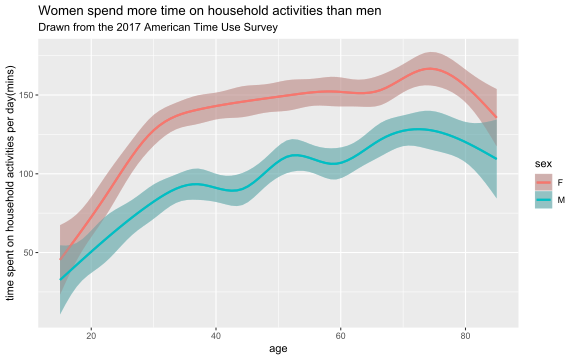

The above graph is based on the data drawn from 2017 American Time Use Survey. It compares the time spent of individual on household activities per day between females and males for the age ranges from around 15 to 85. First of all, the gap between two lines shows that in general, women do more housework than men at each range of age. Besides, the sexual difference is relatively narrow for people who are under 25, since most people are still students at that age range (15-25). With the growth of age, people tend to spend more time on housework. There is a decreasing trend from 70, which might be due to some physical reasons. Lastly, since majority participants are from 20 to 60, more data will be needed to get the conclusion of people who are under 20 and over 70.

### YUE

    03 12 18
    
### ZECHI

    01 04 07
    
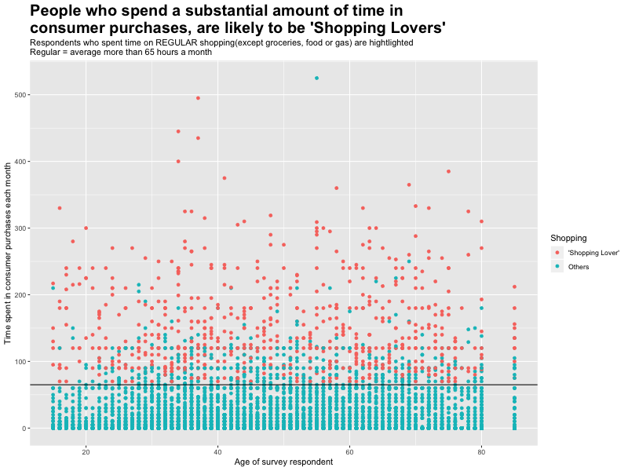

This graph illustrates the number of hours spent on consumer purchases for every survey respondent from the age of 15 to 85. At first glance the points are separated by two colours, with the purple ones denoting respondents who spent a substantial amount of time doing shopping for the purposes outside of groceries, food or gas, who can be interpreted as the term 'shopping lovers'. By 'substantial' here it is defined by the mean time spent in this type of shopping activity(for people who spend any time doing this at all), averaging around 65 hours a month. The line intersecting y = 65 makes a distinctive separation between the top purple and the bottom blue regions, suggesting the fact that people who spend any substantial amount of time in making consumer purchases also spend a substantial amount of time in shopping for non-absolute necessities. This coincides with the modern habits of people shopping for leisure purposes and the popularity of shopping malls/centres. 
    
    
### ZILIN

    04 10 15

